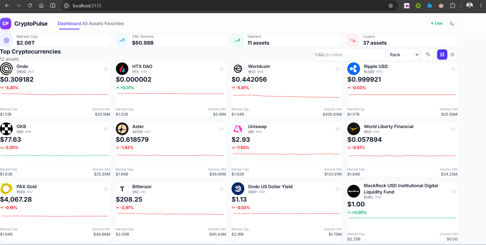
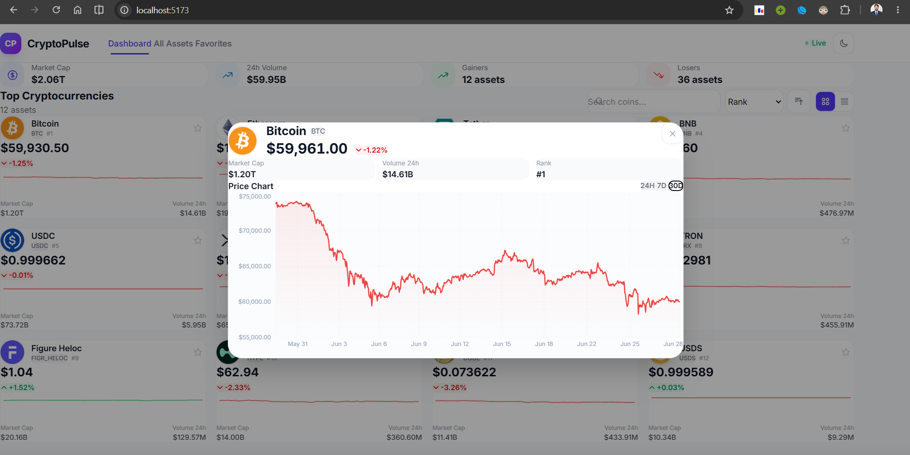
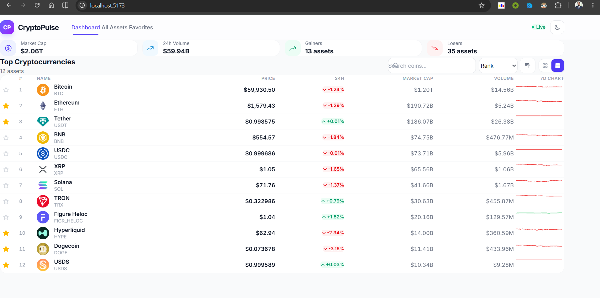
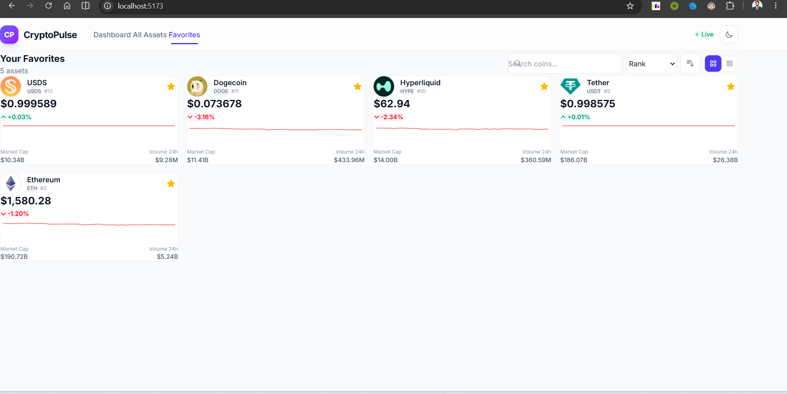

````md
# CryptoPulse

CryptoPulse is a modern cryptocurrency dashboard built with *React*, *TypeScript*, *Vite*, and *Tailwind CSS*. It provides live cryptocurrency market data by combining the CoinGecko REST API with the Kraken WebSocket API for real-time price updates.

## Features

- Live cryptocurrency price updates using the Kraken WebSocket API
- Market overview powered by the CoinGecko API
- Search and filter cryptocurrencies
- Sort assets by market rank, price, market cap, volume, and 24-hour change
- Toggle between grid and table views
- Favorites management with persistent local storage
- Interactive price charts with selectable timeframes
- Dark mode with theme persistence
- Fully responsive design










## Tech Stack

- React 19
- TypeScript
- Vite
- Tailwind CSS
- Apache ECharts
- CoinGecko API
- Kraken WebSocket API

## Project Structure

```text
src/
├── api/
│   └── coingecko.ts
├── components/
├── hooks/
├── types/
├── utils/
└── App.tsx
````

| Directory     | Description                     |
| ------------- | ------------------------------- |
| `api/`        | API integration with CoinGecko  |
| `components/` | Reusable UI components          |
| `hooks/`      | Custom React hooks              |
| `types/`      | Shared TypeScript definitions   |
| `utils/`      | Utility functions and constants |
| `App.tsx`     | Application entry point         |

## Installation

Install the project dependencies:

```bash
npm install
```

## Run the Development Server

```bash
npm run dev
```

The application will be available at the local Vite development server shown in the terminal.

## Build for Production

```bash
npm run build
```

## Preview the Production Build

```bash
npm run preview
```

## Available Scripts

| Command           | Description                          |
| ----------------- | ------------------------------------ |
| `npm run dev`     | Start the development server         |
| `npm run build`   | Build the application for production |
| `npm run preview` | Preview the production build locally |
| `npm run lint`    | Run ESLint                           |

## Dependencies

### Core

* React
* React DOM
* TypeScript
* Vite

### Styling

* Tailwind CSS

### Charts

* Apache ECharts

### APIs

* CoinGecko REST API
* Kraken WebSocket API

## License

This project is intended for educational and portfolio purposes.

```
```
