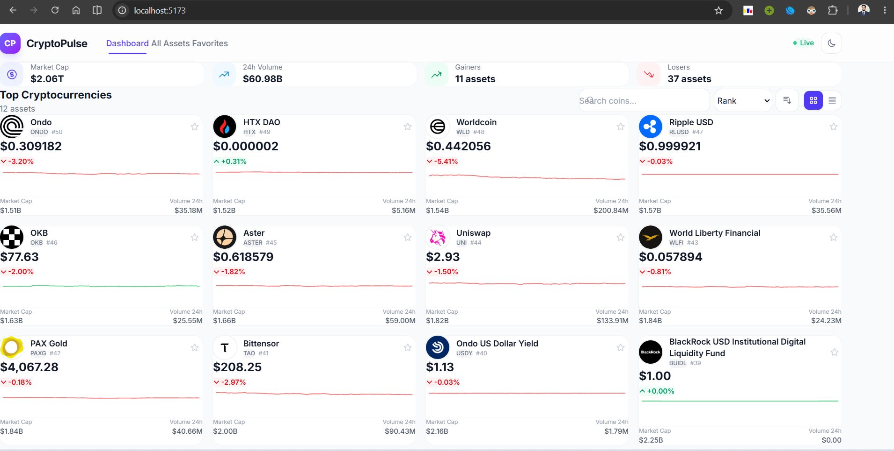
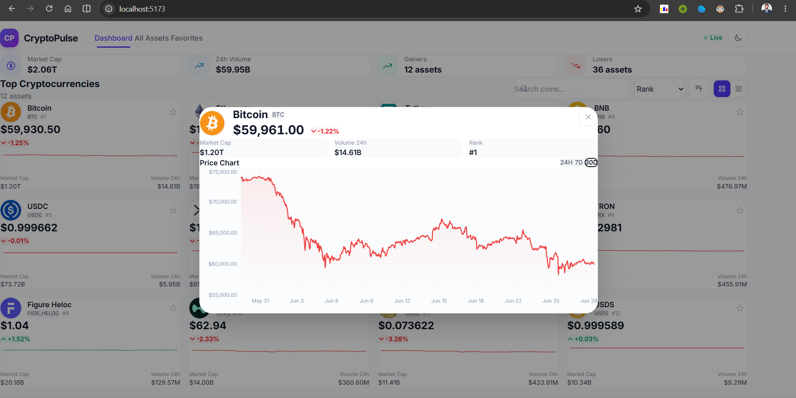
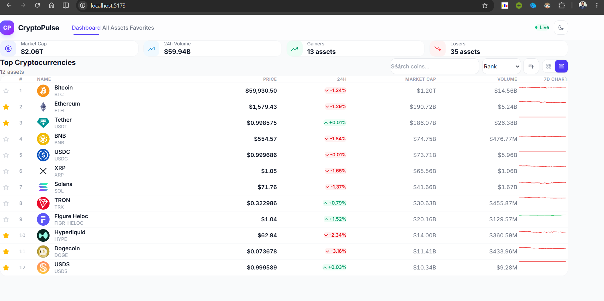
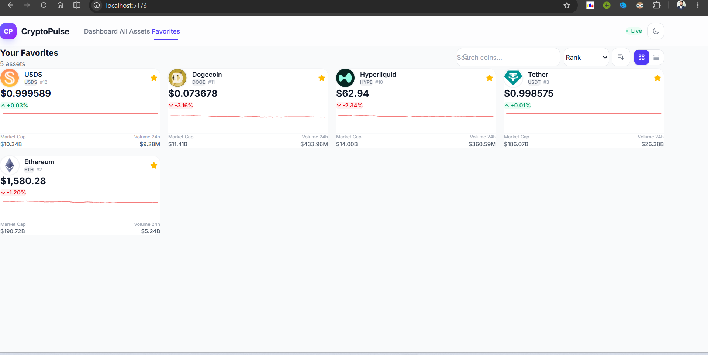

# CryptoPulse

CryptoPulse is a modern real-time cryptocurrency dashboard built with **React 19**, **TypeScript**, **Vite**, and **Tailwind CSS**. It combines the **CoinGecko REST API** for market data with the **Kraken WebSocket API** for live price streaming, delivering a production-quality analytics experience.

**Live Application:** [Click Here](https://course-project-crypto-pulse.vercel.app/)
**Demo Video:** [Click Here](https://drive.google.com/file/d/1BPjS1JzG-sPrbK8Qf2GcdZzUiMvplW2G/view?usp=sharing)

---

## Features

- **Live WebSocket prices** via the Kraken API with automatic reconnection
- **Market overview** powered by CoinGecko (top coins, market cap, volume, 24h change)
- **Search and filter** cryptocurrencies by name or symbol
- **Sort** by market rank, price, market cap, volume, and 24h change
- **Grid / Table view** toggle
- **Favorites** management with `localStorage` persistence
- **Interactive price charts** (Recharts) with 1-day / 7-day / 30-day timeframes
- **Dark mode** with `localStorage` theme persistence
- **Fully responsive** design (mobile-first)
- **Skeleton loading states** and error fallbacks throughout









---

## Architecture & Data Flow

```
┌──────────────────────────────────────────────────────────────────┐
│                           App.tsx                                │
│  ErrorBoundary → ThemeProvider → FavoritesProvider → Layout      │
│                                            → Dashboard           │
└─────────────────────────────┬────────────────────────────────────┘
                              │
          ┌───────────────────┼───────────────────┐
          ▼                   ▼                   ▼
  useFetchAssets     useWebSocketPrices   useFavoritesContext
  (CoinGecko REST)    (Kraken WS)         (localStorage)
          │                   │
          ▼                   ▼
     Asset list         Real-time price
     + pagination       overlays on cards
          │                   │
          ▼                   ▼
  useDashboardFilters   useLiveAssetPrice
  (search/sort/filter)  (merges REST + WS price per asset)
          │
          ├──► DashboardToolbar (search, sort, view toggle)
          ├──► AssetListSection (AssetGrid | AssetTable)
          └──► PriceChart modal (useAssetHistory → CoinGecko)
               useKeyPress (Escape to close modal)
```

### Key Hooks

| Hook | Responsibility |
|------|----------------|
| `useFetchAssets` | Fetches the paginated market list from CoinGecko; auto-refreshes every 90 s |
| `useWebSocketPrices` | Maintains a persistent Kraken WebSocket connection; exposes live prices **and** connection status |
| `useAssetHistory` | Fetches OHLC chart data on demand; caches results per asset+timeframe to avoid redundant requests |
| `useLiveAssetPrice` | Merges REST market data with live Kraken WebSocket prices for a single asset; returns resolved price, 24h change, and direction |
| `useFavorites` | Reads/writes favorite asset IDs to `localStorage` |
| `useTheme` | Reads/writes the active theme to `localStorage` and syncs the `<html>` class |
| `useDashboardFilters` | Encapsulates search, sort, and filtering logic for the dashboard list |
| `useKeyPress` | Attaches a global `keydown` listener for a given key and fires a callback; used to close modals with Escape |

---

## Why CoinGecko instead of CoinCap?

The original project brief referenced CoinCap REST endpoints. After evaluation, **CoinGecko** was chosen for the following reasons:

1. **Richer data**: CoinGecko returns sparkline data, market cap rank, and OHLC history in a single response family, reducing the number of round-trips needed.
2. **Stable free tier**: The `/coins/markets` endpoint is well-documented and rate-limited at ~30 req/min on the free tier sufficient for a 90-second polling interval.
3. **WebSocket pairing**: CoinCap's WebSocket and REST APIs use different asset ID schemes. CoinGecko pairs more naturally with the Kraken WebSocket because both use standard ticker symbols (BTC, ETH, etc.).

The Kraken WebSocket API is still used for **real-time sub-second price updates**, complementing CoinGecko's REST polling.

---

## WebSocket Behavior

- **Connection**: Opens on component mount to `wss://ws.kraken.com/v2`
- **Subscription**: Subscribes to the `ticker` channel for a predefined set of trading pairs (`BTC/USD`, `ETH/USD`, etc.)
- **Reconnection**: Automatically reconnects after a 3-second delay on disconnect. Also reconnects when the browser tab becomes visible again after being backgrounded.
- **Status indicator**: The header shows a live connection status badge: `Connecting`, `Live`, `Reconnecting`, or `Offline`.
- **Price overlay**: WebSocket prices overlay the REST market data in real-time on both grid cards and table rows.

---

## API Limitations & Known Issues

| Limitation | Detail |
|---|---|
| CoinGecko rate limit | Free tier: ~30 req/min. The app uses a 90-second polling interval and shows a friendly message on 429 errors. |
| Kraken pairs only | WebSocket prices are only available for pairs subscribed in `constants.ts`. Assets not on Kraken show REST prices only. |
| Chart data | Historical OHLC data is fetched from CoinGecko on demand; it may be delayed ~5 minutes on the free tier. |
| No server-side rendering | The app is entirely client-side; initial load depends on API response times. |

---

## Tech Stack

| Layer | Technology |
|-------|-----------|
| UI framework | React 19 |
| Language | TypeScript (strict mode) |
| Build tool | Vite |
| Styling | Tailwind CSS **v4** (CSS-first config, no `tailwind.config.js`) |
| Charts | Recharts |
| REST data | CoinGecko API |
| Real-time data | Kraken WebSocket API |
| Testing | Vitest + Testing Library |
| Deployment | Vercel |

---

## Project Structure

```text
src/
├── __tests__/
│   ├── formatters.test.ts    # Unit tests for formatting utilities
│   ├── sorting.test.ts       # Unit tests for sort logic
│   └── wsParser.test.ts      # Unit tests for WebSocket message parsing
├── api/
│   └── coingecko.ts          # CoinGecko REST client
├── components/
│   ├── assets/               # AssetCard, AssetGrid, AssetTable, AssetRow, SparklineChart
│   ├── charts/               # PriceChart modal, ChartTooltip, TimeframeToggle
│   ├── common/               # ErrorBoundary, ErrorFallback, NotificationToast, PriceChange,
│   │                         # SearchBar, SortSelect, ViewToggle, StatsBar, Skeleton
│   ├── dashboard/            # DashboardToolbar, AssetListSection
│   ├── favorites/            # FavoriteButton
│   ├── layout/               # Header (with WS status badge), Footer, Layout
│   ├── theme/                # ThemeToggle
│   └── Dashboard.tsx         # Orchestration component
├── context/
│   ├── FavoritesContext.tsx
│   └── ThemeContext.tsx
├── hooks/
│   ├── useAssetHistory.ts
│   ├── useDashboardFilters.ts
│   ├── useFavorites.ts
│   ├── useFetchAssets.ts
│   ├── useKeyPress.ts         # Global keydown listener utility
│   ├── useLiveAssetPrice.ts   # Merges REST + WebSocket price per asset
│   ├── useTheme.ts
│   └── useWebSocketPrices.ts  # Kraken WS connection + live prices + status
├── types/
│   └── index.ts
├── utils/
│   ├── constants.ts
│   └── formatters.ts
└── App.tsx
```

---

## Installation

```bash
npm install
```

## Run the Development Server

```bash
npm run dev
```

The application will be available at the local Vite development server shown in the terminal.

## Build for Production

```bash
npm run build
```

## Preview the Production Build

```bash
npm run preview
```

## Run Tests

```bash
npm test
```

## Available Scripts

| Command | Description |
|---|---|
| `npm run dev` | Start the development server |
| `npm run build` | Build the application for production |
| `npm run preview` | Preview the production build locally |
| `npm run lint` | Run ESLint |
| `npm test` | Run Vitest unit tests |

---

## Deployment

The application is deployed on **Vercel** with automatic deployments from the main branch.

**Live URL:** [https://course-project-crypto-pulse.vercel.app/](https://course-project-crypto-pulse.vercel.app/)

No environment variables are required all API calls are public and unauthenticated.

---

## License

This project is intended for educational and portfolio purposes.
